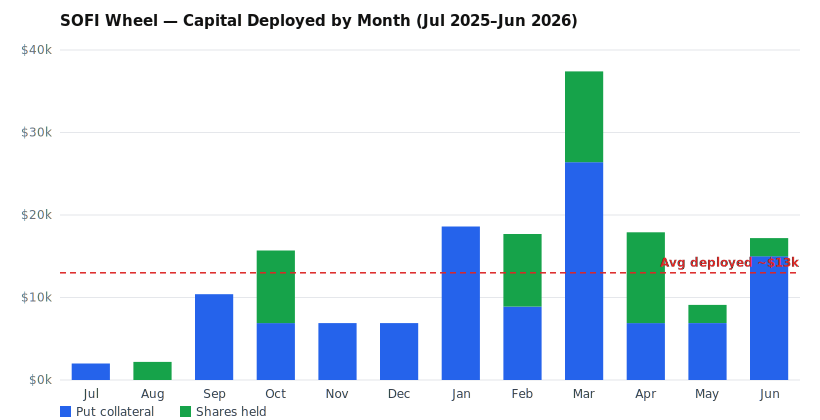

# SOFI Wheel — Return on Capital Analysis

*Generated 2026-06-29 from Robinhood ledger (`sofi_transaction_history.csv`, through May 15 2026) + live account data (individual account ••••8091) through today. SOFI mark: $18.15.*

## Headline

| Metric | Value |
|---|---|
| **Total profit (lifetime wheel)** | **≈ +$16,060** |
| Peak capital deployed (most cash tied up at once) | ≈ $32,100 (May 2024) |
| **Return on that peak capital** | **≈ 50%** |

Over the full life of the strategy you've turned a pool that peaked around **$32k of deployed cash** into roughly **$16k of profit** — about a **50% return on the most capital you ever had at risk at one time.** The strategy is clearly working.

## Where the money came from

| Component | Lifetime |
|---|---|
| Premium collected (puts + calls sold) | +$26,861 |
| Premium paid (buy-to-close + hedges) | −$11,252 |
| Roll credits | +$211 |
| Premium since May 15 (live data) | +$478 |
| **Net option premium** | **≈ +$16,300** |
| Shares bought (assignments + open market) | −$124,799 |
| Shares sold (call-aways + open market) | +$119,119 |
| Current 300 shares @ $19.02 cost, marked at $18.15 | −$263 unrealized |
| **Net stock result** | **≈ −$240 (roughly flat)** |
| **TOTAL** | **≈ +$16,060** |

**The key insight:** essentially *all* of your profit is option premium. The stock leg — buying via put assignment, selling via call-away — nets out to roughly break-even over full cycles. The wheel is doing exactly what it's supposed to: the shares are just collateral that churns near flat, and the premium is the engine.

## On "capital held at one time" — two ways to read it

1. **Cash actually sunk in (out of pocket).** Walking the ledger chronologically, the deepest your cumulative SOFI cash position ever went was **−$32,128 (May 2024)**, during heavy share accumulation around $7. That's the most real money you had committed at once → **~50% total return** against it. *(In just the trailing 12 months, peak out-of-pocket was only ~$6,500 — prior gains were funding the new positions.)*

2. **Buying power reserved.** Cash-secured puts tie up `strike × 100 × contracts` in buying power even when no cash leaves. At your most aggressive (10× $23 puts in Jan 2026 ≈ $23k collateral, on top of shares held), reserved buying power peaked higher than the cash figure. Measured against reserved buying power, the return is more like **~35–40%.** This number is an estimate — the ledger doesn't record option *expirations*, so exact open-collateral at every moment can't be perfectly reconstructed.

Either way you're solidly ahead.

## Return on capital *actually deployed* (capital-weighted, last 12 months)

Peak capital penalizes you for one busy week; net out-of-pocket cash flatters you by recycling old profits. The truest measure is return against **how much capital was tied up over time** — reconstructed from the daily cash-secured-put collateral (each short put reserves `strike × 100` from sale until it closes or expires) plus shares held.

| Basis | Capital | Premium yield |
|---|---|---|
| **Average deployed (capital-weighted)** | **~$13,000** | **~35%** |
| Peak deployed (Mar 2026) | ~$37,400 | ~12% |

Net option premium of **+$4,491** was earned on an average of only **~$13k of working capital** → a **~35% capital-weighted premium yield** over the year (≈ annualized, since the window is ~366 days). This is premium income only; the stock leg ran roughly flat-to-slightly-positive, so total return on deployed capital was a touch higher.

### Month-by-month deployed capital

| Month-end | Total deployed | Puts (collateral) | Shares |
|---|---|---|---|
| 2025-06 | $8,800 | $0 | $8,800 |
| 2025-07 | $2,000 | $2,000 | $0 |
| 2025-08 | $2,200 | $0 | $2,200 |
| 2025-09 | $10,400 | $10,400 | $0 |
| 2025-10 | $15,700 | $6,900 | $8,800 |
| 2025-11 | $6,900 | $6,900 | $0 |
| 2025-12 | $6,900 | $6,900 | $0 |
| 2026-01 | $18,600 | $18,600 | $0 |
| 2026-02 | $17,700 | $8,900 | $8,800 |
| 2026-03 | **$37,400** | $26,400 | $11,000 |
| 2026-04 | $17,900 | $6,900 | $11,000 |
| 2026-05 | $9,100 | $6,900 | $2,200 |
| 2026-06 | $17,200 | $15,000 | $2,200 |

**Takeaway:** deployment is lumpy — average ~$13k against a $37k peak means you're often running well under capacity. The yield is healthy; the lever for more *dollars* (without hurting the yield) is deploying more consistently.

*Method notes: CSP collateral from broker option orders (precise — has strike/expiration/open-close). Share-capital line approximate (held flat at ~$22/share; the live ledger reconciles to ~100 vs the actual 300 shares). Short-put collateral slightly overstates the defined-risk spread trades. CSP collateral is the dominant, cleanly-measured component.*

## Caveats

- Individual account ••••8091 only. If you also run SOFI in the Roth (••••2465), it's not included.
- Stock-leg cash flows are taken from the exported ledger; assignments are included (the live API doesn't expose them cleanly).
- Not tax advice — wash sales and holding periods aren't modeled here.
